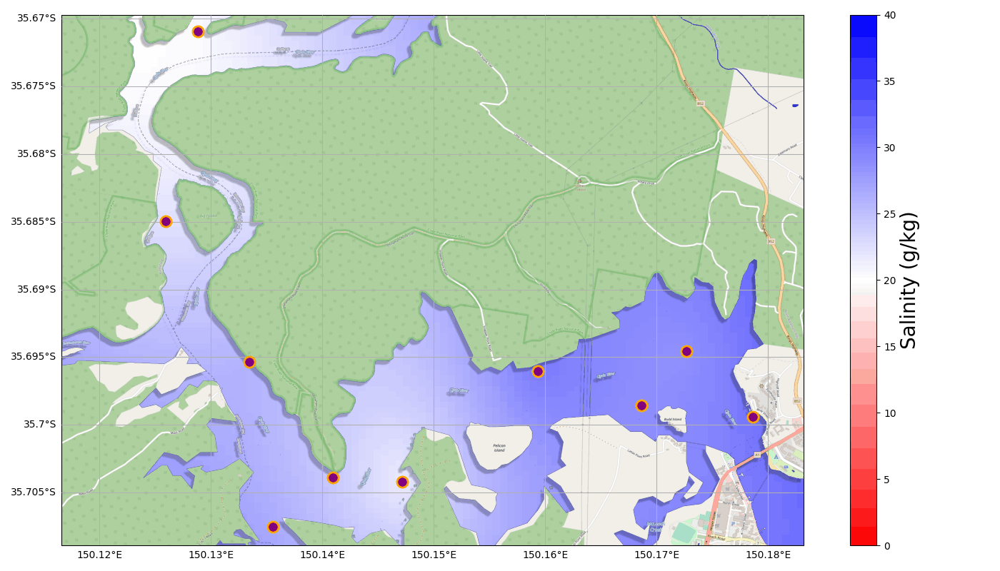

# Heatmap over/underlay for maps

Used to create a 2D-matrix under/overlay for maps based on a [radial basis function](https://en.wikipedia.org/wiki/Radial_basis_function).


Example showing salinity (how salty the water is) readings across a river system on the south coast of NSW.

## Install and Run
### Download
```bash
git clone https://github.com/DPIclimate/HeatMAPS
cd HeatMAPS
``` 
### Install requirements
```bash
# Depending on your python installation do one of the following
pip3 install -r requirements.txt
#or
pip install -r requirements.txt
```
### Run
```bash
cd src/
python3 clydemap.py
```

## Assumptions / pitfalls / things that need improvement 
### Mapping extent
To calculate a 2D-matrix you need data points that extend to the edge of the map. This means that unless you can infer the value at some distance beyond your data point latitudes and longitudes your map will be limited to the max/min longitudes and max/min latitudes.

### Accessing data
Data is currently being accessed asynchronously via ThingSpeak. It takes around 1.2 seconds for ThingSpeak to return a ``json`` response for all buoys if the requested number of results is small. The dates from the results are converted from strings to datetimes, this is pretty processor intensive but makes for a more reliable dataset (see below).


### Interpolation
If you request the last *n* number of data points the devices need to be recording on both the same time interval and without any lost packets (null data points). Failure to do this results in datetime values not being aligned between devices. Alternatively you can request data between two date ranges (YYYY-MM-DD HH:MM:SS) and the program will align all values and provide an interpolation for up to eight missing hours of data.

Each set of data (10 readings from 10 buoys) must go through the ``Rbf`` function individually, thus extending the time taken to resolve a response.

The map has no idea of land boundaries. As such the Clyde river interpolation based on salinity data assumes that there is no landmass between the lower and upper parts of the river. This results in values from near ocean buoys effecting data from upstream buoys.

Interpolation is based off this [function](https://docs.scipy.org/doc/scipy/reference/generated/scipy.interpolate.Rbf.html) in scipy. Perhaps it is possible to limit, via euclidean distance, the influence one geographic object has on another.
